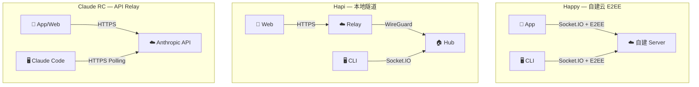

# 竞品远程控制架构分析

> 分析对象：Happy、Hapi、Claude Code Remote Control
> 日期：2026-04-07

---

## 1. Happy — 自建云 E2EE Relay

### 架构

```
📱 React Native App ←Socket.IO→ ☁️ 自建 Server (Fastify+PG) ←Socket.IO→ 🖥️ Happy CLI
```

### CLI 与 Claude Code 的通信：两种模式

#### Local 模式（用户坐在电脑前）

- `stdio: 'inherit'` — CLI 不拦截 I/O，Claude Code 直接占用终端
- **输出捕获**：轮询 Claude Code 写到磁盘的 `.jsonl` 日志文件（`~/.claude/projects/{hash}/{sessionId}.jsonl`）
- `fs.watch` + 3 秒定时器兜底
- `fd 3` 自定义管道追踪 thinking 状态

```
输入: 用户键盘 → (inherit) → Claude Code stdin        [直通]
输出: Claude Code → JSONL 文件 → SessionScanner → Server
控制: Claude Code → fd3 管道 → CLI (thinking 状态)
```

#### Remote 模式（手机远程控制）

- `stdio: ['pipe', 'pipe', 'pipe']` — 全管道化
- Claude Code 参数：`--output-format stream-json --input-format stream-json`
- 输入：`stdin.write(JSON.stringify(message) + '\n')`
- 输出：`readline` 逐行读 stdout JSON
- 权限审批：stdin/stdout 的 `control_request`/`control_response` 双向 JSON

```
输入: 手机消息 → Server → CLI → stdin.write(JSON) → Claude Code
输出: Claude Code stdout → readline(JSON) → CLI → 加密 → Server → 手机
控制: control_request ↔ control_response (权限审批)
```

#### 模式切换

两种模式切换时 **Claude Code 进程会被杀掉重启**，通过 `--resume sessionId` 恢复上下文。

### 关键源码

| 文件 | 职责 |
|------|------|
| `claudeLocal.ts` | spawn + inherit + fd3 |
| `claudeRemote.ts` | PushableAsyncIterable + SDK query |
| `sdk/query.ts` | spawn pipe + readline + control_request |
| `sdk/utils.ts` | `streamToStdin()` — JSON 写入管道 |
| `sessionScanner.ts` | JSONL 文件 watch + 轮询 |
| `sessionProtocolMapper.ts` | SDK 消息 → 标准化 SessionEnvelope |

### 安全模型

- **NaCl E2EE**（`TweetNaCl`）— 零知识，Server 看不到消息明文
- 所有敏感数据在客户端加密后再传输

---

## 2. Hapi — 本地优先 WireGuard 隧道

### 架构

```
📱 PWA Web ←HTTPS→ ☁️ Relay (纯转发) ←WireGuard→ 🏠 Local Hub (Hono+SQLite) ←Socket.IO→ 🖥️ CLI
```

### 关键特点

- **Hub 运行在本机**，数据永不出本机
- 公网穿透用 `tunwg`（WireGuard 隧道），Relay 是纯透明代理
- 支持 5 种 Agent：Claude Code、Codex CLI、Aider、Goose、GenAI Code
- 文件上传：`Web (Base64) → HTTP POST → Hub → Socket.IO RPC → CLI (Write to Disk)`

### 安全模型

- 数据不出本机（Hub 在本地）
- WireGuard 加密隧道
- Relay 零知识（看不到内容）

---

## 3. Claude Code Remote Control — 官方内置

### 架构

```
📱 claude.ai/code ←HTTPS→ ☁️ Anthropic API (消息 Relay) ←HTTPS Polling→ 🖥️ Claude Code
```

### 关键特点

- **Outbound-Only** — 本机只向外发 HTTPS 请求，不开入站端口
- **Long Polling** — Claude Code 不断轮询 Anthropic API 获取新消息
- 代码/文件/环境变量**永不离开本机**
- 短生命周期、独立过期的多凭证 (JWT)
- 闭源实现，不可自定义

### 从泄露源码反推的内部架构

| 子系统 | 模块数 | 关键文件 |
|--------|--------|----------|
| `bridge/` | 31 | `pollConfig.ts`, `bridgeApi.ts`, `jwtUtils.ts`, `remoteBridgeCore.ts` |
| `remote/` | 4 | `RemoteSessionManager.ts`, `SessionsWebSocket.ts` |
| `cli/transports/` | 7 | `SSETransport.ts`, `WebSocketTransport.ts`, `HybridTransport.ts` |

> 实际实现比官方文档描述的"简单 Polling"要复杂得多——包含 SSE + WebSocket + 混合传输。

### 安全模型

- TLS 传输加密（非零知识，Anthropic 可见消息内容）
- OAuth 认证 + 短生命周期凭证

---

## 4. 三方对比



| 维度 | Claude RC | Happy | Hapi |
|------|-----------|-------|------|
| **连接协议** | HTTPS Long Polling | Socket.IO (WebSocket) | Socket.IO + SSE + REST |
| **加密级别** | TLS（非零知识） | NaCl E2EE（零知识） | WireGuard + TLS |
| **部署成本** | 零 | 高（PG+Redis+S3） | 低（单二进制） |
| **Agent 支持** | 仅 Claude Code | Claude + Codex | 5 种 Agent |
| **客户端** | claude.ai Web + App | React Native App | PWA |
| **开源** | ❌ | ✅ MIT | ✅ AGPL-3.0 |
| **自定义能力** | ❌ 封闭 | ✅ 完全可控 | ✅ 完全可控 |

---

## 5. 对 Clawke 的启示

### Clawke 的核心差异化

| | Happy | Hapi | **Clawke** |
|---|---|---|---|
| **UI 架构** | 客户端硬编码 React | 客户端硬编码 PWA | **CUP SDUI 动态下发** |
| **新增交互** | 需发版 App | 需发版前端 | **Server 推 JSON，客户端零改** |
| **Agent 扩展** | 改 CLI 代码 | 改 CLI 代码 | **Gateway 插件化** |

> Happy/Hapi 每增加一种 Agent 交互（工具状态、权限审批），前端必须硬编码新组件并发版。
> Clawke 通过 CUP `ui_component` 动态下发——Server 推一个新 JSON，客户端自动渲染。

### 可借鉴的模式

1. **Happy 的 `--input-format stream-json` + `--output-format stream-json`** — 最成熟的 Claude Code 管道通信方案
2. **Happy 的 `PushableAsyncIterable`** — 优雅的消息队列模式
3. **Happy 的 `sessionProtocolMapper`** — SDK 消息→标准协议的转译层（Clawke 对应 `sdk-to-cup.ts`）
4. **Hapi 的文件上传 RPC** — Base64 文件传输管道
5. **Claude RC 的 Outbound-Only 安全模型** — 不开入站端口
