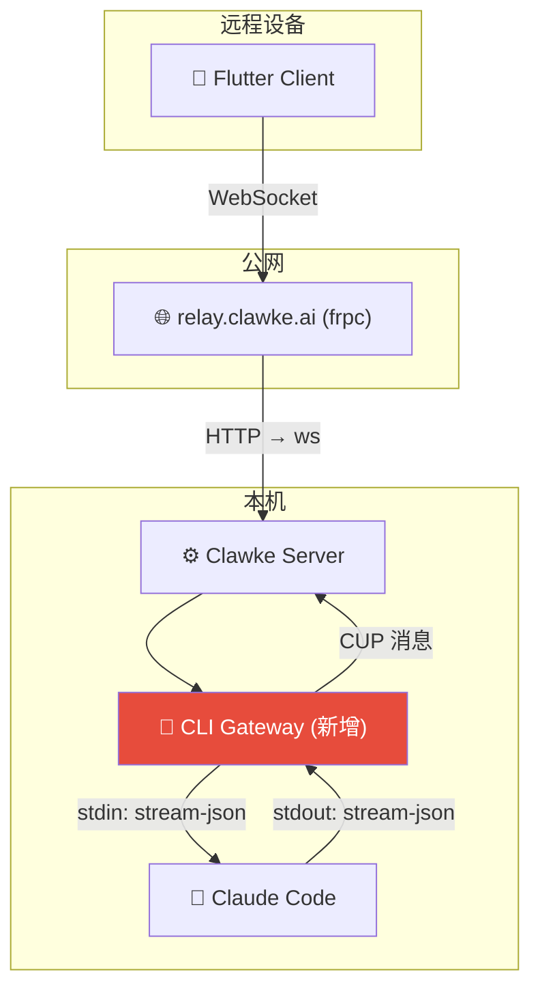
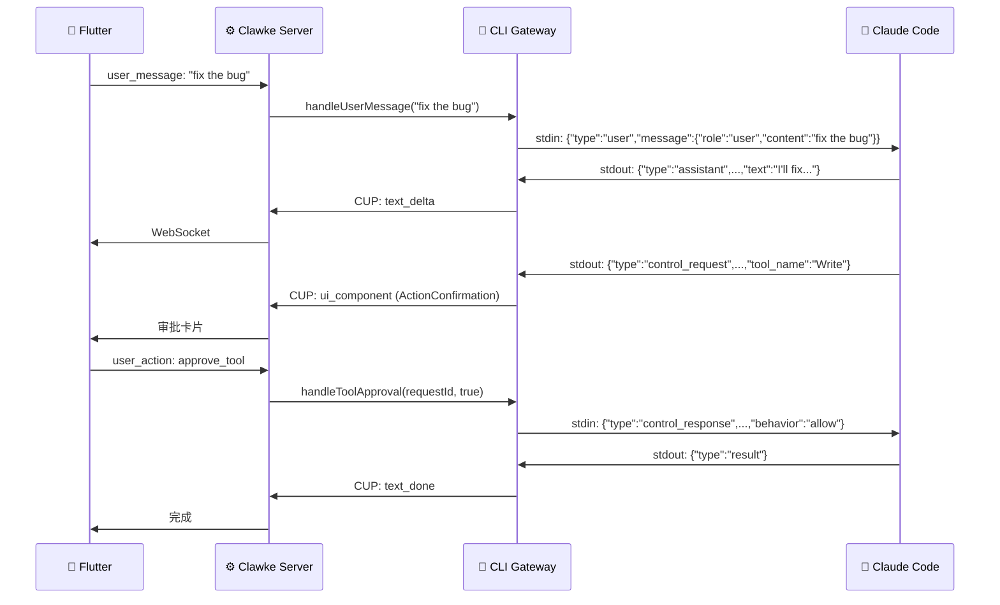

# Clawke CLI Gateway 实现方案

> 目标：让 Flutter 客户端（手机/桌面）通过 Clawke Server 远程操控本机的 Claude Code
> 日期：2026-04-07

---

## 现状

### 已有基础设施

```
Flutter Client ←ws:8765→ Clawke Server ←ws:8766→ OpenClaw Gateway (192.168.0.7)
                              ↓
                         frpc 隧道 → relay.clawke.ai (公网访问)
```

| 已有能力 | 说明 |
|---------|------|
| CUP 协议 | 完整 SDUI，支持 text_delta / thinking_delta / ui_component |
| WebSocket 双向通信 | client ↔ server 实时通道 |
| frpc 公网隧道 | frpc-manager.ts + device-auth.ts |
| EventRegistry 事件分发 | user_message / user_action / abort |
| Gateway 反腐败层 | Agent 特定逻辑封装在 Gateway |
| 消息持久化 | SQLite + MessageStore + ConversationStore |

### 需要新增

```
Flutter Client ←CUP/ws→ Clawke Server ←stdio pipe→ Claude Code CLI (本机)
                                         ↑
                                   CLI Gateway (新增)
```

---

## 架构设计



### 设计决策

| 决策 | 选择 | 理由 |
|------|------|------|
| Claude Code 通信 | `--input-format stream-json --output-format stream-json` | Happy Remote 模式验证过 |
| Gateway 位置 | Server 进程内 | 复用 EventRegistry |
| 公网穿透 | 复用 frpc 隧道 | 零新增基础设施 |
| UI 下发 | CUP SDUI | 核心差异化 |
| 权限审批 | `--permission-prompt-tool stdio` + CUP `ActionConfirmation` | 管道内 JSON 双向通信 |
| 会话恢复 | `--resume <sessionId>` | Claude Code 原生能力 |

---

## 新增文件

```
server/src/
├── cli-gateway/
│   ├── cli-gateway.ts          # Gateway 主模块
│   ├── claude-process.ts       # Claude Code 子进程管理
│   ├── sdk-to-cup.ts           # SDK stream-json → CUP 转译
│   └── types.ts                # SDK 消息类型定义
```

---

## P0: 核心管道

### claude-process.ts — 子进程管理

```typescript
import { spawn, ChildProcess } from 'child_process';
import { createInterface } from 'readline';
import { EventEmitter } from 'events';

export class ClaudeProcess extends EventEmitter {
  private child: ChildProcess | null = null;
  private sessionId: string | null = null;

  async start(opts: { cwd: string; sessionId?: string; permissionMode?: string }) {
    const args = [
      '--output-format', 'stream-json',
      '--input-format', 'stream-json',
      '--verbose',
      '--permission-prompt-tool', 'stdio',
    ];
    if (opts.sessionId) args.push('--resume', opts.sessionId);
    if (opts.permissionMode) args.push('--permission-mode', opts.permissionMode);

    this.child = spawn('claude', args, {
      cwd: opts.cwd,
      stdio: ['pipe', 'pipe', 'pipe'],
    });

    const rl = createInterface({ input: this.child.stdout! });
    rl.on('line', (line) => {
      if (!line.trim()) return;
      try { this.emit('message', JSON.parse(line)); } catch {}
    });

    this.child.stderr?.on('data', (d) => console.error('[Claude stderr]', d.toString()));
    this.child.on('exit', (code) => this.emit('exit', code));
  }

  sendMessage(text: string) {
    this.child?.stdin?.write(JSON.stringify({
      type: 'user', message: { role: 'user', content: text }
    }) + '\n');
  }

  sendPermissionResponse(requestId: string, allow: boolean) {
    this.child?.stdin?.write(JSON.stringify({
      type: 'control_response',
      response: {
        subtype: 'success', request_id: requestId,
        response: { behavior: allow ? 'allow' : 'deny' },
      },
    }) + '\n');
  }

  abort() { this.child?.kill('SIGTERM'); }
}
```

### sdk-to-cup.ts — SDK → CUP 转译

```typescript
export function translateSdkToCup(sdkMsg: any): any[] {
  const cups: any[] = [];

  if (sdkMsg.type === 'assistant') {
    for (const block of sdkMsg.message?.content || []) {
      if (block.type === 'text')
        cups.push({ payload_type: 'text_delta', message_id: sdkMsg.uuid, content: block.text });
      if (block.type === 'thinking')
        cups.push({ payload_type: 'thinking_delta', message_id: sdkMsg.uuid, content: block.thinking });
      if (block.type === 'tool_use')
        cups.push({
          payload_type: 'ui_component',
          component: {
            widget_name: 'ToolStatusCard',
            props: { tool_call_id: block.id, tool_name: block.name, status: 'running', args: block.input },
          },
        });
    }
  }

  if (sdkMsg.type === 'result')
    cups.push({ payload_type: 'text_done', message_id: sdkMsg.uuid });

  if (sdkMsg.type === 'control_request' && sdkMsg.request?.subtype === 'can_use_tool')
    cups.push({
      payload_type: 'ui_component',
      component: {
        widget_name: 'ActionConfirmation',
        props: {
          request_id: sdkMsg.request_id,
          title: `Allow ${sdkMsg.request.tool_name}?`,
          tool_name: sdkMsg.request.tool_name,
          input: sdkMsg.request.input,
        },
        actions: [
          { action_id: 'approve_tool', label: 'Allow', type: 'remote' },
          { action_id: 'deny_tool', label: 'Deny', type: 'remote' },
        ],
      },
    });

  if (sdkMsg.type === 'system' && sdkMsg.subtype === 'init' && sdkMsg.session_id)
    cups.push({ payload_type: 'system_status', status: 'session_started', session_id: sdkMsg.session_id });

  return cups;
}
```

### cli-gateway.ts — Gateway 主模块

```typescript
import { ClaudeProcess } from './claude-process.js';
import { translateSdkToCup } from './sdk-to-cup.js';

export class CliGateway {
  private claude: ClaudeProcess;
  private broadcast: (msg: any) => void;

  constructor(opts: { broadcast: (msg: any) => void }) {
    this.broadcast = opts.broadcast;
    this.claude = new ClaudeProcess();

    this.claude.on('message', (sdkMsg) => {
      for (const cup of translateSdkToCup(sdkMsg)) {
        this.broadcast(cup);
      }
    });
  }

  async start(cwd: string, sessionId?: string) {
    await this.claude.start({ cwd, sessionId });
  }

  handleUserMessage(text: string) { this.claude.sendMessage(text); }
  handleToolApproval(requestId: string, approved: boolean) { this.claude.sendPermissionResponse(requestId, approved); }
  handleAbort() { this.claude.abort(); }
}
```

### index.ts 集成 — 新增 `cli` 模式

```typescript
// 在 mock / openclaw 分叉下新增
} else if (MODE === 'cli') {
  const { CliGateway } = await import('./cli-gateway/cli-gateway.js');
  const gateway = new CliGateway({ broadcast: (msg) => broadcastToClients(msg) });
  await gateway.start(process.cwd());

  registry.register('user_message', createUserMessageHandler({
    cupHandler, stats: statsCollector,
    cliGateway: gateway,
    processMessageMedia,
  }));

  registry.register('abort', createAbortHandler({
    cliAbort: () => gateway.handleAbort(),
  }));

  actionRouter.register('approve_tool', (ctx) => gateway.handleToolApproval(ctx.data.request_id, true));
  actionRouter.register('deny_tool', (ctx) => gateway.handleToolApproval(ctx.data.request_id, false));
}
```

---

## P0 数据流



---

## P1: 交互增强

| 功能 | 说明 |
|------|------|
| ToolStatusCard | 工具执行状态展示 |
| 会话恢复 | Server 持久化 sessionId，--resume 恢复 |
| 多会话 | 多个 Claude Code 子进程（不同 cwd） |
| Subagent 追踪 | Task 子代理状态跟踪 |

### Flutter 新增 Widget

```dart
// widget_factory.dart
case 'ActionConfirmation':
  return ActionConfirmationWidget(props: props, onAction: onAction);
case 'ToolStatusCard':
  return ToolStatusWidget(props: props);
```

---

## P2: 多 Agent 扩展

| 功能 | 说明 |
|------|------|
| Codex 支持 | 新增 codex-process.ts |
| Agent 选择器 | CUP 下发 AgentSelector 组件 |
| 混合模式 | OpenClaw + Claude Code 共存 |
| 文件传输 | Base64 文件上传 |

---

## 核心优势 vs 竞品

| 能力 | Happy | Hapi | **Clawke** |
|------|-------|------|-----------|
| 远程 UI | React Native (硬编码) | PWA (硬编码) | **CUP SDUI (动态下发)** |
| 权限审批 | App 内弹窗 | Web 页面 | **CUP 卡片 (Server 控制)** |
| 新增交互 | 需发版 App | 需发版前端 | **Server 推 JSON，客户端零改** |
| 公网穿透 | 自建 Server | WireGuard | **frpc (已有)** |
