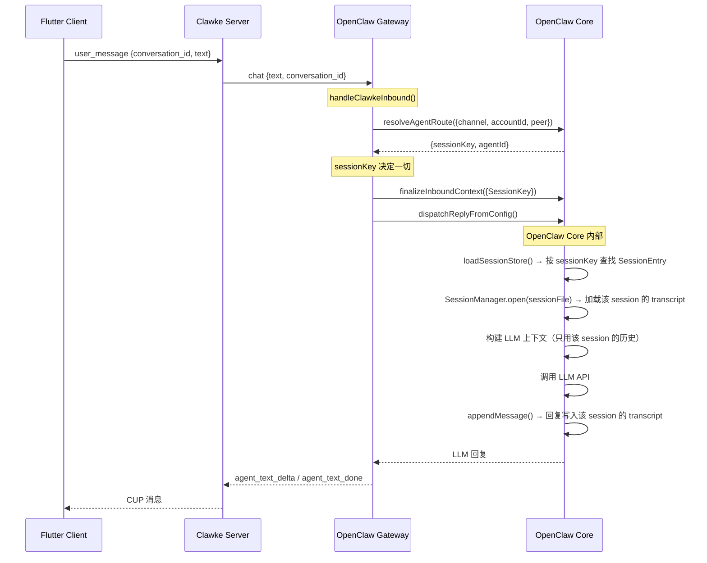

# OpenClaw Session 隔离机制 — 源码级确认

## 核心结论

**✅ 是的，OpenClaw 完全支持基于 sessionKey 的独立会话隔离。** 不同的 sessionKey 会产生：

1. **独立的 SessionEntry**（`sessions.json` 中按 key 索引）
2. **独立的 sessionId**（UUID，首次创建时自动生成）
3. **独立的 transcript 文件**（`{sessionId}.jsonl`，物理文件隔离）
4. **独立的上下文**（LLM 对话历史、token 计数、模型覆盖等全部 per-session）

---

## 1. SessionKey 是如何生成的

### 路由核心：resolve-route.ts

```typescript
// resolve-route.ts L678-708 — choose() 函数
const choose = (agentId, matchedBy) => {
  const sessionKey = buildAgentSessionKey({
    agentId: resolvedAgentId,
    channel,        // "clawke"
    accountId,      // "OpenClaw"
    peer,           // { kind: "direct", id: "clawke:clawke_user" }
    dmScope,        // 来自 cfg.session.dmScope
    identityLinks,
  }).toLowerCase();
  ...
};
```

### DM 会话的 sessionKey 取决于 `dmScope` 配置

session-key.ts — `buildAgentPeerSessionKey()`：

| dmScope 值 | sessionKey 格式 | 隔离粒度 |
|------------|----------------|---------|
| `"main"` (默认) | `agent:main:main` | **所有 DM 共享一个 session** |
| `"per-peer"` | `agent:main:direct:{peerId}` | 每个用户独立 session |
| `"per-channel-peer"` | `agent:main:clawke:direct:{peerId}` | 每个渠道×用户独立 |
| `"per-account-channel-peer"` | `agent:main:clawke:{accountId}:direct:{peerId}` | 最细粒度 |

> **⚠️ 重要**：当前 Clawke Gateway 硬编码 `peerId = "clawke:clawke_user"`，所以即使配置了 `per-peer`，也只会产生一个固定的 sessionKey。要实现多会话隔离，需要将客户端的 `conversation_id` 传递为 `peerId` 的一部分。

---

## 2. SessionEntry — 每个 sessionKey 独立存储

### 数据结构

每个 sessionKey 对应一个 `SessionEntry`，包含：

```typescript
type SessionEntry = {
  sessionId: string;        // UUID — 唯一标识此会话
  updatedAt: number;        // 最后活动时间
  sessionFile?: string;     // transcript 文件路径
  
  // 以下字段全部 per-session 独立
  inputTokens?: number;
  outputTokens?: number;
  totalTokens?: number;
  model?: string;
  modelProvider?: string;
  compactionCount?: number;
  thinkingLevel?: string;
  reasoningLevel?: string;
  modelOverride?: string;
  providerOverride?: string;
  // ... 200+ 行的 per-session 状态
};
```

### 存储方式

- **持久化文件**：`~/.openclaw/state/agents/{agentId}/sessions/sessions.json`
- **格式**：`Record<sessionKey, SessionEntry>`  — sessionKey 就是 JSON key
- **写锁保护**：`withSessionStoreLock()` 确保并发安全
- **自动维护**：过期清理 (`pruneStaleEntries`)、数量上限 (`capEntryCount`)、文件轮转 (`rotateSessionFile`)

```json
// sessions.json 示例
{
  "agent:main:main": {
    "sessionId": "a1b2c3d4-...",
    "updatedAt": 1712649600000,
    "sessionFile": "a1b2c3d4-....jsonl"
  },
  "agent:main:direct:clawke:clawke_user": {
    "sessionId": "e5f6g7h8-...",
    "updatedAt": 1712649700000
  }
}
```

---

## 3. Transcript — 每个 session 独立的聊天记录文件

### 文件路径

```typescript
// 每个 sessionId 对应一个独立的 .jsonl 文件
function resolveSessionTranscriptPathInDir(sessionId, sessionsDir, topicId) {
  const fileName = topicId
    ? `${sessionId}-topic-${topicId}.jsonl`   // 线程消息
    : `${sessionId}.jsonl`;                    // 主会话消息
  return path.join(sessionsDir, fileName);
}
```

**物理路径示例**：
```
~/.openclaw/state/agents/main/sessions/
├── sessions.json                          # SessionEntry 索引
├── a1b2c3d4-xxxx-xxxx-xxxx-xxxxxxxxxxxx.jsonl  # 会话 A 的聊天记录
├── e5f6g7h8-xxxx-xxxx-xxxx-xxxxxxxxxxxx.jsonl  # 会话 B 的聊天记录
└── ...
```

---

## 4. 会话隔离的完整数据流



---

## 5. 三个功能的最终判定

### ✅ 功能 1：基于 Session ID 的物理隔离

**OpenClaw 完全支持。** 隔离发生在三个层面：

| 层面 | 隔离机制 | 证据 |
|------|---------|------|
| 路由层 | `sessionKey` 由 `channel + accountId + peer + dmScope` 确定性生成 | resolve-route.ts L678 |
| 存储层 | `sessions.json` 中每个 sessionKey 有独立 `SessionEntry` | store.ts L82-121 |
| 历史层 | 每个 sessionId 有独立的 `.jsonl` transcript 文件 | paths.ts L235-251 |

> **⚠️ 阻塞项**：Clawke Gateway 当前硬编码 `senderId = "clawke_user"`（gateway.ts L207），导致所有请求路由到同一个 sessionKey。修复方案：将客户端 `conversation_id` 映射到 `peerId`。

### ✅ 功能 2：跨代理并行

**Clawke Server 已支持。** `accountId` 路由表（`Map<accountId, WebSocket>`）允许 OpenClaw + Nanobot 等多个 Gateway 同时连接。OpenClaw 内部 `agentId` 路由进一步支持同一 Gateway 内多个 Agent。

### ✅ 功能 3：状态持久化

**OpenClaw 完全支持。** 三层持久化：

| 层 | 存储 | 重启恢复 |
|----|------|---------|
| Session 索引 | `sessions.json`（JSON 文件） | ✅ sessionKey → SessionEntry 映射完整恢复 |
| 聊天历史 | `{sessionId}.jsonl`（JSONL 文件） | ✅ 只要 sessionId 不变，上下文完整恢复 |
| Clawke Server 消息 | `clawke.db`（SQLite） | ✅ globalSeq 从 DB 恢复，客户端增量同步不中断 |

---

## 6. 实现多会话隔离的改造方向

要让 Clawke 真正利用 OpenClaw 的多会话能力，核心改动：

1. **Gateway 层**：将客户端 `conversation_id` 传入 `peerId`（替代硬编码 `clawke_user`）
2. **OpenClaw 配置**：设置 `session.dmScope: "per-peer"` 或 `"per-channel-peer"`
3. **Clawke Server 层**：确保 `conversation_id` 在 `user_message` → `chat` 转发中透传
4. **Flutter 客户端**：实现多会话 UI（会话列表、新建会话、会话切换）
