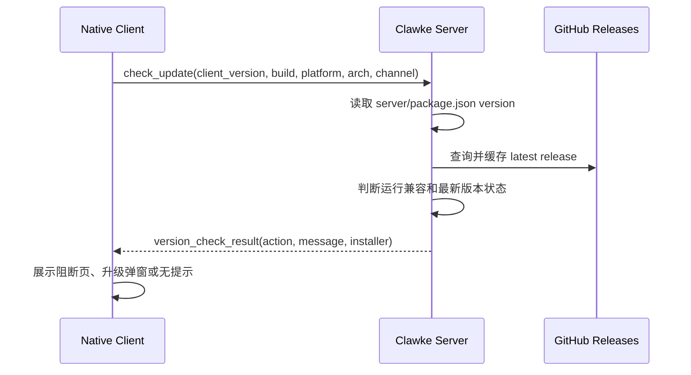
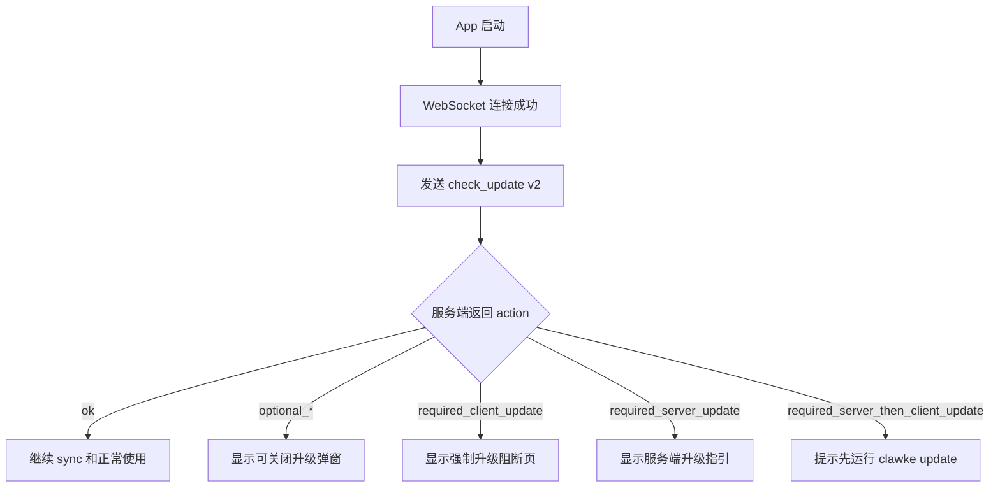

# Clawke 版本兼容与客户端自动升级设计

## 背景

`clawke update` 只负责升级 Clawke Server 和 Gateway 侧代码，这是正确边界。客户端是独立安装的 Native App，不应该由 `clawke update` 直接管理。

问题在于 Server 升级后，客户端可能仍停留在旧版本。Clawke 的 CUP、HTTP、WebSocket 事件和 SDUI 组件都可能随版本变化。只要客户端和服务端版本不一致，就有接口不匹配风险。

当前已有的升级逻辑主要是“客户端版本低于 GitHub 最新 Release 时提示升级”，但它没有完整解决两个问题：

- 当前客户端能不能安全连接当前服务端。
- GitHub 上是否有更新版本，以及升级时应该先升级服务端还是客户端。

## 目标

- 客户端启动后自动检查当前客户端和当前服务端是否兼容。
- 设置页手动“检查更新”复用同一套检查结果。
- 版本判断由服务端完成，客户端保持瘦客户端。
- 客户端和服务端 `major.minor` 不一致时阻断；patch/build 差异只提示风险，不阻断。
- 客户端和 GitHub 最新客户端比较时，按 ICU 风格区分强制升级和可选升级。
- Android 支持应用内下载 APK 并调用系统安装器。
- macOS、Windows、Linux 支持下载对应安装包后打开系统安装流程。
- iOS 和商店渠道遵守平台规则，只跳转 App Store、TestFlight 或对应商店。

## 非目标

- 不改变 `clawke update` 的职责。它仍然只升级服务端和 Gateway。
- 不做全平台静默安装。桌面端和移动端都必须经过系统允许的安装流程。
- 不在客户端内执行 `clawke update`。
- 不要求客户端内置复杂版本规则。
- 不在第一版接入 Sparkle、MSIX 后台更新服务或 Linux 包管理器 sudo 安装。

## 版本规则

### 客户端和当前服务端

客户端版本和服务端版本按 `major.minor` 判断运行兼容线。`major.minor` 不一致时阻断；patch 差异只提示“可能不兼容或出现异常”，用户可点“知道了”继续。

```text
Client 3.8.1 + Server 3.8.1 = 兼容
Client 3.8.1 + Server 3.8.2 = 可继续使用，但提示建议升级客户端
Client 3.9.0 + Server 3.8.1 = 不兼容，必须先升级服务端
```

build number 不参与运行兼容判断。

```text
Client 3.8.1+83 + Server 3.8.1 = 兼容
Client 3.8.1+84 + Server 3.8.1 = 兼容
```

### 客户端和 GitHub 最新客户端

客户端和最新客户端比较时，采用 ICU 风格规则：

```text
major.minor 不同 = 强制升级
major.minor 相同但 patch/build 不同 = 可选升级
完全相同 = 无需升级
```

示例：

```text
Client 3.8.1 + Latest 3.8.2 = 可选升级
Client 3.8.1 + Latest 3.9.0 = 强制升级
Client 3.8.1 + Latest 4.0.0 = 强制升级
```

由于运行兼容要求客户端和服务端处在同一 `major.minor` 兼容线，客户端升级必须和服务端升级顺序配合：

- 如果当前 Server 和 Client 的 `major.minor` 不一致，优先处理运行兼容问题。
- 如果当前 Server 和 Client 一致，但 GitHub 有新版本，提示先运行 `clawke update` 升级服务端，再升级客户端。

## 总体方案

新增统一版本检查能力，由服务端负责判断并返回客户端可直接展示的结果。



客户端只做四件事：

- 读取自己的版本、build、平台、架构和安装渠道。
- 启动后自动发送版本检查请求。
- 手动检查更新时发送同一个请求。
- 按服务端返回的 `action` 和 `installer` 执行 UI 或安装动作。

服务端负责：

- 读取当前服务端版本。
- 比较客户端和服务端是否处在同一 `major.minor` 兼容线。
- 查询并缓存 GitHub 最新 Release。
- 按平台和架构选择下载资产。
- 判断强制升级、可选升级、服务端先升级或客户端先升级。
- 返回标题、说明、按钮动作、下载链接和安装方式。

## API 设计

复用现有 WebSocket `check_update` 事件，增加新版请求字段。旧客户端不带 `version_check_protocol` 时，服务端保持旧响应结构，避免破坏已发布版本。

### 请求

```json
{
  "event_type": "check_update",
  "data": {
    "version_check_protocol": 2,
    "app_version": "3.8.1",
    "app_build": "83",
    "platform": "macos",
    "arch": "arm64",
    "install_channel": "direct",
    "protocol_version": "cup_v2"
  }
}
```

字段说明：

- `app_version`: 客户端语义版本，不含 build。
- `app_build`: 客户端 build number。
- `platform`: `macos`、`windows`、`linux`、`ios`、`android`。
- `arch`: `arm64`、`x64` 等。
- `install_channel`: `direct`、`app_store`、`testflight`、`play_store`、`apk`、`msix`、`appimage` 等。
- `protocol_version`: 当前 CUP 协议版本。

### 响应

```json
{
  "payload_type": "system_status",
  "status": "version_check_result",
  "action": "recommended_client_update",
  "compatibility": {
    "compatible": true,
    "warning": "patch_mismatch",
    "reason": "client_server_patch_mismatch",
    "client_version": "3.8.1",
    "server_version": "3.8.2",
    "required_client_version": "3.8.2"
  },
  "latest": {
    "version": "3.8.2",
    "upgrade": 2,
    "release_date": "2026-05-21",
    "changelog": "..."
  },
  "presentation": {
    "title": "需要升级客户端",
    "message": "当前服务端版本为 3.8.2，客户端版本为 3.8.1。版本不完全一致，可能不兼容或出现异常；建议升级客户端到 3.8.2。",
    "primary_label": "立即升级",
    "secondary_label": "知道了"
  },
  "installer": {
    "method": "download_and_install",
    "url": "https://github.com/.../Clawke-3.8.2.apk",
    "asset_name": "Clawke-3.8.2-android-arm64.apk",
    "sha256": ""
  }
}
```

## Action 语义

| Action | 含义 | UI 行为 |
| --- | --- | --- |
| `ok` | 当前客户端和服务端一致，且没有需要提示的新版本 | 不提示 |
| `recommended_client_update` | 服务端和客户端同 `major.minor`，但服务端 patch 更新 | 可选提示，显示“知道了”和“立即升级” |
| `recommended_server_update` | 服务端和客户端同 `major.minor`，但客户端 patch 更新 | 可选提示，显示“知道了”和“重新检查” |
| `required_client_update` | 服务端和客户端 `major.minor` 不同，且客户端较旧 | 阻断主流程，只允许升级 |
| `required_server_update` | 服务端和客户端 `major.minor` 不同，且服务端较旧 | 阻断主流程，提示运行 `clawke update` |
| `optional_server_then_client_update` | 当前客户端和服务端一致，GitHub 有同 major.minor 的新 patch | 可选提示，建议先升级服务端再升级客户端 |
| `required_server_then_client_update` | 当前客户端和服务端一致，但 GitHub 最新版 major.minor 更高 | 强制提示先升级服务端，再升级客户端 |
| `check_failed` | GitHub 查询失败，但本地兼容检查可完成 | 不阻断使用，只提示无法确认最新版本 |

优先级：

1. 客户端和当前服务端 `major.minor` 不一致时，先返回 `required_client_update` 或 `required_server_update`。
2. 客户端和当前服务端只有 patch 差异时，先返回 `recommended_client_update` 或 `recommended_server_update`。
3. 客户端和当前服务端一致后，再判断 GitHub 最新版本。
4. GitHub 不可访问时，不影响本地兼容判断。

## 平台安装策略

| 平台 | 第一版安装方式 |
| --- | --- |
| Android | 下载 APK 到应用私有外部目录，校验后调用系统安装器 |
| iOS | 跳转 App Store 或 TestFlight |
| macOS direct | 下载 DMG 或 ZIP，校验后用系统打开 |
| macOS App Store | 跳转 Mac App Store |
| Windows | 下载 EXE 或 MSIX，校验后打开安装器 |
| Linux | 优先下载 AppImage，校验后 `chmod +x` 并打开；deb/rpm 用 `xdg-open` 打开 |

Android 可参考旧项目 `rc-world` 的结构：

- Flutter 使用下载库下载 APK 并显示进度。
- 下载完成后通过 MethodChannel 调用 Android 原生安装。
- Android 侧使用 `REQUEST_INSTALL_PACKAGES` 和 `FileProvider`。
- 系统会要求用户确认安装，客户端不绕过系统权限。

Clawke 不直接照搬旧代码，需要按当前 Flutter 版本、包名、主题、日志规范和平台目录重新实现。

## 客户端流程

### 启动自动检查



启动检查应该早于主要业务交互。若检查结果为阻断状态，客户端不进入聊天主流程。

### 手动检查更新

设置页“检查更新”调用同一个 `check_update v2`。区别只在 UI：

- 手动触发时，即使 `ok` 也可以 toast “当前已是匹配版本”。
- 自动触发时，`ok` 不提示。

### App Store 构建

兼容检查不能被 `inAppUpdatesEnabled` 禁用。

现有策略中，App Store 构建会关闭应用内更新提示。新设计需要拆分：

- `compatibility_check_enabled`: 始终启用。
- `in_app_install_enabled`: 由平台和渠道决定。

App Store 构建仍然必须上报客户端版本，让服务端判断是否兼容。只是安装动作改为打开商店。

## 服务端流程

服务端新增或重构版本服务，例如：

```text
server/src/services/version-service.ts
```

职责：

- 读取 `server/package.json` 的版本。
- 缓存 GitHub latest release。
- 解析和比较语义版本。
- 判断 client-server 是否处于同一 `major.minor` 兼容线。
- 判断 client-latest 的 ICU 风格升级级别。
- 根据 platform、arch、install_channel 匹配 release asset。
- 生成客户端展示用的 `presentation` 和 `installer`。

现有 `VersionChecker` 可以保留为兼容壳，内部委托到新服务。

## Release Asset 命名约定

服务端要可靠匹配安装包，需要发布产物命名稳定。

建议命名：

```text
Clawke-3.8.2-macos-arm64.dmg
Clawke-3.8.2-macos-x64.dmg
Clawke-3.8.2-windows-x64.exe
Clawke-3.8.2-linux-x64.AppImage
Clawke-3.8.2-android-arm64.apk
```

如果 GitHub Release 提供 `sha256` 文件，服务端应把校验值一起返回。客户端下载后先校验，再进入安装动作。

## 错误处理

- GitHub 查询失败：本地兼容检查仍然生效；最新版本状态返回 `unknown`。
- 找不到当前平台安装包：提示打开 Release 页面，不阻断本地兼容使用。
- 下载失败：弹窗显示失败状态，允许重试；强制升级时不允许进入主流程。
- 校验失败：删除下载文件，提示安装包校验失败，不启动安装。
- Android 未授权安装未知来源：交给系统弹出授权页或提示用户去系统设置开启。
- Linux 无法执行 AppImage：提示用户在文件管理器或终端中打开下载文件。

## 测试计划

### Node.js

新增 `server/test/version-service.test.js`：

- client/server 完全一致返回 `ok`。
- client/server 只有 patch 差异返回 `recommended_client_update` 或 `recommended_server_update`。
- client/server `major.minor` 不一致返回 `required_client_update` 或 `required_server_update`。
- client/server 一致但 latest patch 更新返回可选升级。
- client/server 一致但 latest major.minor 更新返回强制 server-then-client 升级。
- GitHub 缓存为空时仍能完成本地兼容判断。
- platform/arch asset 匹配正确。
- 旧版 `check_update` 请求保持旧响应结构。

### Flutter

新增或扩展 `client/test/upgrade/*_test.dart`：

- 新响应模型解析正确。
- required action 会进入强制升级状态。
- optional action 可关闭。
- App Store 构建仍发送兼容检查字段。
- Android installer 使用 MethodChannel，可通过 mock channel 验证调用参数。

### 手动验证

- Server 和 Client 同版本：正常进入应用。
- Server 比 Client 新但同 `major.minor`：启动后提示升级客户端，并允许点“知道了”继续。
- Client 比 Server 新但同 `major.minor`：启动后提示升级服务端，并允许点“知道了”继续。
- Server/Client `major.minor` 不一致：启动后阻断并提示升级客户端或服务端。
- GitHub latest patch 新：显示可选升级。
- GitHub latest major.minor 新：强制提示先升级服务端。
- Android 下载 APK 后进入系统安装确认页。
- macOS direct 下载 DMG 后用系统打开。
- Linux 下载 AppImage 后能打开或给出明确失败提示。

## 迁移策略

第一阶段：

- 保留现有 `check_update` 旧协议。
- 新客户端发送 `version_check_protocol: 2`。
- 服务端对 v2 返回 `version_check_result`。
- 旧客户端继续收到 `update_available` 或 `up_to_date`。

第二阶段：

- 客户端启动路径改为先做兼容检查，再进入主流程。
- 设置页“检查更新”改用同一结果模型。
- Android 补齐自动下载和原生安装。
- 桌面端补齐下载后打开安装包。

第三阶段：

- 根据发布渠道完善资产校验和更多商店跳转。
- 评估 macOS direct 是否接入 Sparkle。
- 评估 Windows 是否支持 MSIX 更完整的更新体验。

## 验收标准

- 客户端和服务端 `major.minor` 不一致时，客户端必须阻断主流程。
- 客户端和服务端只有 patch 差异时，客户端必须提示风险，但允许点“知道了”关闭弹窗。
- 客户端和服务端版本一致时，不能因为 GitHub 网络失败而阻断使用。
- 服务端返回的 action 足以驱动客户端 UI，客户端不内置业务判断。
- 手动检查和启动自动检查结果一致。
- Android 能完成“确认升级、下载、调起系统安装器”的闭环。
- iOS、macOS App Store 渠道不尝试绕过商店安装。
- 所有新增测试不访问生产数据库 `server/data/clawke.db`。
